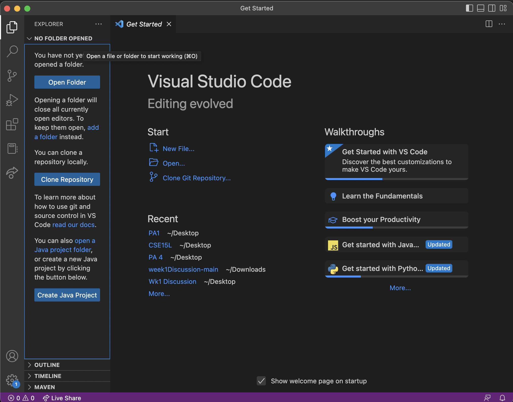
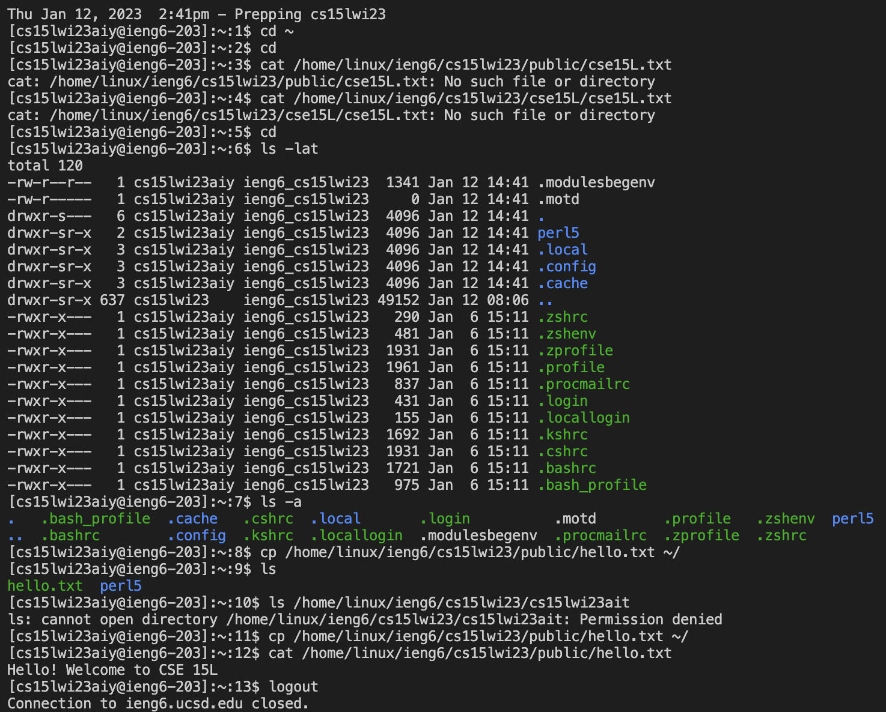

# CSE15L Week 1 Lab Report 

During the week 1 lab, students were tasked with `activating their Cse15L accounts`, `downloading VSCode`, and `running a few example lines of code within the terminal`. In order to accomplish these goals, the students like myself had to complete a sequence of steps in which consist of:

## 1) Activating your CSE15L specific account
---
To activate your account, enter the UCSD [educational technology services website](https://sdacs.ucsd.edu/~icc/index.php) and look up your account. Once you enter your credentials and log in, you will be prompted to reset your password. To do this, enter your current password and new passwords in the specified boxes. Once this is done, `**DO NOT** hit the submit button, but rather, click return on your keyboard while on the new password box`. After changing your password, it will take around 5 minutes for it to take action.

## 2) Downloading VSCode 
---
- if you already have vscode downloaded on your computer, you can skip this step.
If you do not have vscode, enter [this link](https://code.visualstudio.com/) and `download the version specific to the device you are using`. 

Following your download, open the application. You should see something like this:


## 3) Remotely Connecting to VSCode 
---
- if you are using a windows computer, you will need to download git using [this link](https://gitforwindows.org/)
- then, follow the steps on this [stack overflow link](https://stackoverflow.com/questions/42606837/how-do-i-use-bash-on-windows-from-the-visual-studio-code-integrated-terminal/50527994#50527994)

**I did not complete this step because I own a macbook**

The next step would be to `create a new file` and `open a new terminal`. When in the terminal you will enter the line of code: `$ ssh cs15lwi23zz@ieng6.ucsd.edu`. 
- **do not include the '$' sign when typing in your code**. This is just a symbol in which is used to signify a line of code.
- **replace the 'zz' in the line of code with your Cse15L specific letters**. *this is the account you saw when activating your account.*

If this is the first time you are connect to the server, something like 
```
⤇ ssh cs15lwi23zz@ieng6.ucsd.edu
The authenticity of host 'ieng6.ucsd.edu (128.54.70.227)' can't be established.
RSA key fingerprint is SHA256:ksruYwhnYH+sySHnHAtLUHngrPEyZTDl/1x99wUQcec.
Are you sure you want to continue connecting (yes/no/[fingerprint])? 
```
will pop up. enter 'yes' into your terminal and continue. 

If you are successful, you will be prompted to enter a password. In the terminal, `enter the password you just set for your CSE15L account`.

you will see something along the lines of: 


## 4) Running commands in the terminal 
---
At this part of the lab, students were tasked with `running some lines of code in the terminal`. The lines of code consist of:
```
cd ~
cd
ls -lat
ls -a
ls <directory> where <directory> is /home/linux/ieng6/cs15lwi23/cs15lwi23abc, where the abc is one of the other group members’ username
cp /home/linux/ieng6/cs15lwi23/public/hello.txt ~/
cat /home/linux/ieng6/cs15lwi23/public/hello.txt
```


---

once completing all the steps, you have finished the lab !

enter ctrl-D or type 'exit' into the terminal to close the sever.
