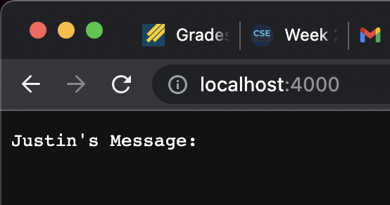
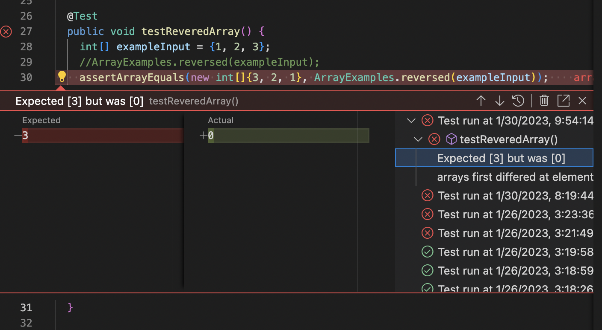

# CSE15L Lab Report 2 by Justin Nguyen

This week, students were tasked with the creation and implementation of a String Server in which takes in a String
and prints it on the local website. If we want to add another String, it will print on a new line on the website. 

---

## Part 1 - creating the String Server

Using the labs as a reference, I created the String Server using the wavelet folder. I created a new file called 
`StringServer.java` and created two classes: the `Handler class` and the `StringServer class`. Once I finished with
the code, it looked like this: 


To explain what is going on in the code, we are first initializing the message to be blank. Then, we are starting the 
local host and running the program. If there is no path, the code will print "Justin's String:" as there is no string. 
However, if there is a the path `/add-message/` and there is a string after the query, then it will print that string.
If we run the program again, the new string will be added under the first string. 

For example, if we run these lines of code on the local host in VSCode:
```
- javac StringServer.java
- java StringServer 4000
```
we will start the server with the port 4000 and the site will look like:


Next, if we change the URL to contain `/add-message/` and add your string to the end of the query, you will add strings to the site.
For example, if we run
```
-http://localhost:4000/add-message?s=hello
and then
-http://localhost:4000/add-message?s=there
```
we will get the site to look like:


Specific items, such as message and the URL are being changed every time we change the local host URL. 
---

## Part 2 - Identifying and fixing bugs

From the lab from week 3, students were tasked with indentifying bugs from a code and reporting the failure inducing
test, the symptoms, and what was changed in order to fix it. An example of this can be seen in the example below:

From the ArrayExamples file, the method `reversed` contained an error. The original code looked like:

```
static int[] reversed(int[] arr) {
    int[] newArray = new int[arr.length];
    for(int i = 0; i < arr.length; i += 1) {
      arr[i] = newArray[arr.length - i - 1];
    }
    return arr;
}
```

When testing the method using a JUnit test,
it resulted in an error message that looks like:



The failure inducing input was `{1, 2, 3}` and the symptom was `{0, 0, 0}`

This happened because the code was creating a new array in order to pass the values of the originial array through it, 
however, the code was instead updating the original array with values from the new Array, which was empty. Consequently,
the new array was changed to become full of zeros and was returned. 

In order to fix this error, we should change the code to look like this:

```
static int[] reversed(int[] arr) {
    int[] newArray = new int[arr.length];
    for(int i = 0; i < arr.length; i += 1) {
      newArray[i] = arr[arr.length - i - 1];
    }
    return newArray;
}
```
Now, the code is updating the values of the newArray by using values from the original array. 

---

## Part 3

Some things that I have learned throughout the past 2 weeks while in this class consist of learning how to
create a program in which takes in a URL. I was also able to refresh my memory on how to correctly use JUnit tests
to determine whether or not my code is working in the way I want. 
