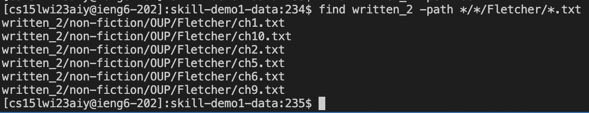
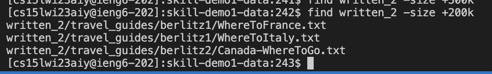

# Lab Report 3 by Justin Nguyen
---
## Researching commands for `**find**` 

The find command is a very versatile tool in which we can use to search for various files within a directory/folder. 
When you are provided with extremely large repositories, we dont want to look through each folder for a specific file, 
so we turn to the find command

This command can be paired with many different keywords that narrow down the search. One of which being:
## the `-name` option

When using the `-name` keyword after the find command in the terminal, Bash will look for every file that contains whatever you
place after the keyword. The syntax in which you would use this keyword can be demonstrated as follows : 
`$ find <currentdirectory> -name <what you want to find>`

As an example, this command can be used like so within the written_2 directory:

Example 1 input : `$ find written_2 -name ch1.txt`
Example 1 output: 

Example 2 input : `$ find written_2 -name Bahamas-History.txt`
Example 2 output: 

you can learn more about the `-name` command on a website such as [this](https://linuxhostsupport.com/blog/how-to-search-files-on-the-linux-terminal/#:~:text=The%20find%20command%20allows%20you%20to%20search%20a%20specific%20file,that%20you%20want%20to%20search.&text=You%20can%20use%20the%20following,f%20%E2%80%93%20regular%20file)

## the `-type` option

When using the `-type` keyword after the find command in the terminal, Bash will look for every file that can be referred as the
type you input after the keyword. For example, if you insert the `d` keyword after `-type`, Bash will return all the directories, 
or folders.  The syntax in which you would use this keyword can be demonstrated as follows :
`$ find <current directory> -type <type you are searching for>`

As an example, this command can be used like so within the written_2 directory:

Example 1 input : `$ find written_2 -type f`
Example 1 output: 

Example 2 input: `$ find written_2 -type d`
Example 2 output: 

you can learn more about the `-type` keyword on a website such as [this](https://linuxize.com/post/how-to-find-files-in-linux-using-the-command-line/)

## the `-path` option

When using the `-path` keyword after the find command in the terminal, Bash will look for every file that contains a certain portion of a path. 
Many people who are familiar with Bash commands use this keyword when they are trying to search for files that they only know contain certain 
phrases or words in their path. The syntax in which you would use this keyword can be demonstrated as follows:
`$ find <current directory> -path <portion of path>`

As an example, this command can be used to find certain files in the written_2 directory:

Example 1 input : `$ find written_2 -path */*/Fletcher/*.txt`
Example 1 output : 

Example 2 input: `$ find written_2 -path */*/Kauffman/*.txt`
Example 2 output : 

## the `-size` option

When using the `-size` keyword after the find command in the terminal, Bash will look for files that contain up to a certain amount of characters/lines.
For example, we could use this keyword to search for files that contain only up to 100 chracters or 200k characters. To use this keyword, you must also place either a `+ or -` before your desired range, referring to more or less than the desired range. The syntax in which you would use this keyword can be demonstrated as follows:
`$ find <current directory> -size <+/-><desired size range>`

As an example, this command can be used to find files within the written_2 directory:

Example 1 input: `$ find written_2 -size -100k`
Example 1 output: 

Example 2 input: `$ find written_2 -size +200k`
Example 2 output: 

you can learn more about the `-size` keyword on a website such as [this](https://www.fosslinux.com/8661/how-to-find-files-using-command-line-in-the-linux-terminal.htm)
